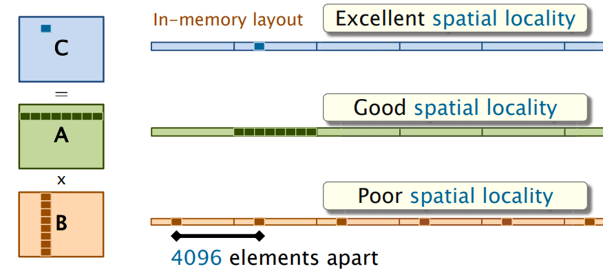

# 2-matrix-multiply

设A,B,C为 n × n 的方阵，其中n为2的幂，一般的矩阵可以填零使得n为2的幂。计算C = A · B 的结果

## 基本信息

**输入文件格式**

大小为n*n的二维整数数组。

文件为二进制格式，最前端4个字节是一个无符号32位整数n，表示矩阵的边长，之后的n*n个4字节有符号整数为数据内容

**函数格式**

```c++
void example_function(
    const int32_t *const *const a,
    const int32_t *const *const b,
    int32_t *const *const c,
    const uint32_t size)
```

**编译指令**

```makefile
make
```

**清理指令**

```makefile
make clean
```

**运行指令**

```bash
matrix-mul <filename_A> <filename_B>
```


## 任务1：缓存优化的矩阵乘法

这里我们假定ABC均用一维数组存储。最简单的计算C = A · B的方法是

```c++
for(int i = 0;i < n;i++)
	for(int j = 0;j < n;j++)
        for(int k = 0;k < n;k++)
            C[i*n+j] += A[i*n+k] * B[k*n+j];
```

假设n = 4096，在计算过程中，每次访问的不是B中的连续的元素，因此访问B的过程缓存命中率低，进而增大了总计算时间，如图



将三层循环的顺序由“i-j-k”换成“i-k-j”

```c++
for(int i = 0;i < n;i++)
	for(int k = 0;k < n;k++)
        for(int j = 0;j < n;j++)
            C[i*n+j] += A[i*n+k] * B[k*n+j];
```

这时每次访问的都是B,C中的连续元素，缓存命中率高，总计算时间相对于上一个方案会有所提升


**任务要求**

参考以上内容，查阅相关资料，编写loop.cpp文件中的loop函数以实现缓存优化的矩阵乘法，并且编译运行，程序会判断结果是否正确并测量运行时间


## 任务2：分治的矩阵乘法

将A,B,C分成相等大小的方块矩阵：


于是


**任务要求**

参考以上内容，查阅相关资料，编写divide_and_conquer.cpp文件中的divide_and_conquer函数以实现分治的矩阵乘法，并且编译运行，程序会判断结果是否正确并测量运行时间


## 任务3：strassen矩阵乘法

将A,B,C分成相等大小的方块矩阵：


于是


引入新矩阵


可得：


其中的计算也是使用strassen算法求得。

**任务要求**

参考以上内容，查阅相关资料，编写strassen.cpp文件中的strassen函数以实现strassen矩阵乘法，并且编译运行，程序会判断结果是否正确并测量运行时间


## 参考文献

\[1\]Charles E. Leiserson. Introduction & Matrix Multiplication[EB/OL]. [2021-10-15]. https://ocw.mit.edu/courses/electrical-engineering-and-computer-science/6-172-performance-engineering-of-software-systems-fall-2018/lecture-slides/MIT6_172F18_lec1.pdf.

\[2\]维基百科. 施特拉森算法[EB/OL]. [2021-10-15]. https://zh.wikipedia.org/wiki/%E6%96%BD%E7%89%B9%E6%8B%89%E6%A3%AE%E6%BC%94%E7%AE%97%E6%B3%95.