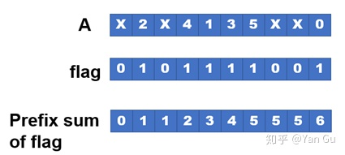

# 1-sort

对一维整数数组进行排序

## 基本信息

**输入文件格式**

长度为n的一维整数数组。

文件为二进制格式，最前端4个字节是一个无符号32位整数n，表示数组的长度，之后的n个4字节有符号整数为数据内容

**编译指令**

```makefile
make
```

**清理指令**

```makefile
make clean
```

**运行指令**

```bash
sort <filename>
```


## 任务1：快速排序

**快速排序**

快速排序使用[分治法](https://zh.wikipedia.org/wiki/分治法)（Divide and conquer）策略来把一个[序列](https://zh.wikipedia.org/wiki/序列)（list）分为较小和较大的2个子序列，然后递归地排序两个子序列。

步骤为：

1. 挑选基准值：从数组中挑出一个元素，称为“基准”（pivot）
2. 分割：重新排序数组，所有比基准值小的元素摆放在基准前面，所有比基准值大的元素摆在基准后面（与基准值相等的数可以到任何一边）。在这个分割结束之后，对基准值的排序就已经完成。
3. 递归排序子序列：[递归](https://zh.wikipedia.org/wiki/递归)地将小于基准值元素的子序列和大于基准值元素的子序列排序。

递归到最底部的判断条件是数组的大小是零或一，此时该数组显然已经有序。

选取基准值有数种具体方法，此选取方法对排序的时间性能有决定性影响。

**并行化**

快速排序的并行化关键是对分割数组过程的并行，在并行中会使用到并行求前缀和

前缀和。并行求前缀和的方法请读者自行查阅资料掌握，这里不再赘述



并行分割过程的步骤如下：

1. 创建与待分割数组的长度相同的整型数组flag，并行地判断array[i]<=pivot是否成立，将判断结果用0,1表示并存储在flag中
2. 对flag并行地求前缀和（prifix sum），存储在一个长度相同的数组index中。可以观察到，index中与前一项值不同的项即为分割完成后小于等于pivot的元素在新数组中的下标
3. 根据index数组并行地将原数组中的元素添加到新数组

上述步骤完成后，小于等于pivot的元素已经在新数组中就绪，接下来只需用同样的方法将大于pivot的元素添加到新数组即可

**任务要求**

参考以上内容，查阅相关资料，编写quick_sort.cpp文件中的quick_sort函数以实现快速排序，并且编译运行，程序会判断结果是否正确并测量运行时间


## 任务2：归并排序

**归并排序**

归并排序有很多实现方式，自顶向下的方式是将一个序列的前一半和后一半分别排序，然后将两个有序的子序列合并，即得到有序的序列

步骤为：

1. 递归排序子序列：将数组的前一半和后一半递归地排序
2. 合并（merge）：依次比较两个有序数组的第一个元素，每次比较后将较小的元素移动到新数组中

递归的结束判断条件是数组里只有0~1个元素，此时数组显然有序

**并行化**

归并排序的关键是对合并数组过程的并行，步骤如下：


1. 利用二分查找，找出待合并的两个有序数组中所有元素的中位数，以及这个中位数在两个数组中分别对应的位置。这个查找整体中位数的过程可以在log级别的时间复杂度内完成
2. 记两个数组分别被中位数分割为【A】【B】、【C】【D】，那么合并后的数组就为【A与C合并】【B与D合并】
3. 递归地计算【A与C合并】、【B与D合并】

**任务要求**

参考以上内容，查阅相关资料，编写merge_sort.cpp文件中的merge_sort函数以实现归并排序，并且编译运行，程序会判断结果是否正确并测量运行时间


## 参考文献

\[1\]维基百科. 快速排序[EB/OL]. [2021-10-15]. https://zh.wikipedia.org/wiki/%E5%BF%AB%E9%80%9F%E6%8E%92%E5%BA%8F.

\[2\]维基百科. 归并排序[EB/OL]. [2021-10-15]. https://zh.wikipedia.org/wiki/%E5%BD%92%E5%B9%B6%E6%8E%92%E5%BA%8F.

\[3\]Yan Gu. 并行算法科普向 系列之三：归并与归并排序，过滤与快速排序[EB/OL]. [2021-10-15]. https://zhuanlan.zhihu.com/p/93279731.

